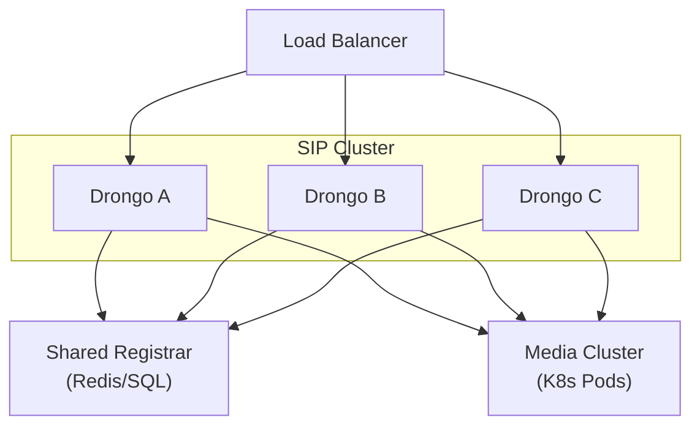

# Drongo — Distributed Architecture Evolution

We'll split this into two problems:
1. Multiple SIP servers with shared state
2. Multiple media servers in a Kubernetes cluster

They are related but not identical.

---

## Part 1 — Multiple SIP Servers with Shared State

### The Core Problem

SIP is stateful. State lives in:
- Transactions
- Dialogs
- Registrations
- Authentication challenges
- NAT bindings (if present)

If you run two servers behind a load balancer:

Without stickiness:
- INVITE lands on Node A
- ACK lands on Node B
- Dialog breaks

So we must define a strategy.

---

## Option A — Sticky Load Balancing (Simplest)

**Model:** Load balancer routes based on:
- Call-ID hash
- Source IP
- Cookie (WebRTC)

All in-dialog requests hit same node.

**Architecture Changes:** Minimal. You only need:
- Shared Registrar (Redis/SQL)
- Shared Authentication store
- Dialogs remain in-memory and node-local

| Pros | Cons |
|------|------|
| Fast | Node failure drops active calls |
| Simple | No seamless failover |
| No distributed locking | |
| No distributed dialog replication | |

For Phase 2 production readiness, this is sufficient.

---

## Option B — Stateless Signaling + Distributed Dialog Store

Now we're serious.

**Goal:** Any node can handle any in-dialog request.

This requires:
- Dialog state externalization
- Distributed coordination
- Event ordering guarantees

### Architectural Change 1: Dialog Becomes a State Machine Snapshot

Instead of:
```csharp
class DialogActor { ... }
```

We need:
```csharp
interface IDialogStateStore
{
    Task<DialogSnapshot?> LoadAsync(string dialogId);
    Task SaveAsync(DialogSnapshot snapshot);
}
```

Each request:
1. Load snapshot
2. Execute state transition
3. Persist new snapshot

This becomes event-sourced or snapshot-based.

### Architectural Change 2: Transaction Layer Must Be Reentrant

Transactions can no longer assume:
- In-memory timer ownership
- Local event ownership

Timers must be:
- Deterministic
- Possibly reconstructed

**Better approach:** Keep transactions node-local. Only replicate dialog state. Require sticky routing for transactions.

That hybrid approach is common in telecom cores.

### Architectural Change 3: Distributed Registrar Is Mandatory

Registrar must move to:
- Redis
- Postgres
- Or distributed KV

It must support:
- Expiration
- Atomic replace
- Compare-and-swap

---

## Recommended Model for Drongo

Do NOT make dialogs fully distributed in early versions.

**Recommended Production Model:**
- Sticky routing required
- Shared registrar
- Stateless authentication
- Dialogs remain node-local
- Add `IDialogReplicationStrategy` but default = None

---

## Part 2 — Multiple Media Servers in Kubernetes

This is a different layer. Media is data-plane. Signaling is control-plane. Do not tightly couple them.

### New Architecture: Control Plane vs Data Plane

| Control Plane (Drongo Core) | Data Plane (Media Cluster) |
|-----------------------------|---------------------------|
| SIP | RTP termination |
| Routing | Mixing |
| Dialog logic | Transcoding |
| Script execution | SRTP |
| Media orchestration | WebRTC |

### Architecture Shift Required

Currently:
```
InviteContext → IMediaSession (local)
```

In distributed model:
```
InviteContext → IMediaOrchestrator
```

### New Abstraction

```csharp
public interface IMediaOrchestrator
{
    Task<MediaAllocation> AllocateAsync(MediaRequest request);
    Task ReleaseAsync(string allocationId);
}

public sealed class MediaAllocation
{
    public string AllocationId { get; }
    public string SdpAnswer { get; }
    public Uri MediaServerEndpoint { get; }
}
```

### How It Works in Kubernetes

1. SIP INVITE arrives
2. Drongo calls IMediaOrchestrator
3. Orchestrator selects media pod
4. Media pod returns SDP
5. Drongo returns SDP in 200 OK
6. RTP flows directly to media pod

**Result:** Signaling stays on Drongo. RTP goes to media node.

### Media Server Scaling Model

Media nodes are:
- Stateless
- Horizontally scalable
- Discovered via:
  - Kubernetes service
  - gRPC registry
  - Redis
  - etcd

They should expose:
- gRPC control API
- Health check
- Metrics

### Important: Media Must Be Disposable

Never assume media session bound to SIP node. Instead:
- SIP node holds allocation ID
- Media node holds actual RTP state

If SIP node dies:
- Media session eventually times out

### Failure Scenarios

| Scenario | Result |
|----------|--------|
| SIP node dies | Calls drop (unless dialog replication exists); Media sessions orphaned; Media GC must reap unused sessions |
| Media node dies | SIP detects RTP timeout; Dialog transitions to terminated; Script canceled |

---

## Advanced Model (Future)

For real carrier-grade, introduce:
- Media affinity routing
- Media cluster state in Redis
- Distributed event bus (NATS / Kafka)
- Dialog event streaming

### New Component Required: Drongo.Cluster

**Responsibilities:**
- Node identity
- Health reporting
- Distributed locking (optional)
- Media discovery
- Registrar integration

---

## Revised High-Level Architecture (Distributed)



---

## Key Architectural Decisions You Must Make

1. Are dialogs replicated or sticky?
2. Is media local or remote?
3. Do you need failover for active calls?
4. Is WebRTC required (changes NAT handling)?

---

## My Recommendation for Drongo's Evolution

### Phase 1–2
- Sticky routing
- Distributed registrar
- Media local

### Phase 3
- Media orchestration abstraction
- Kubernetes media pods
- Optional cluster coordination layer

Do NOT introduce distributed dialog replication until you absolutely need HA failover for live calls. That's a complexity explosion.

---

## The Critical Insight

Signaling scales differently than media:
- **SIP** is low bandwidth, high state complexity
- **RTP** is high bandwidth, low state complexity

Treat them as separate planes.
